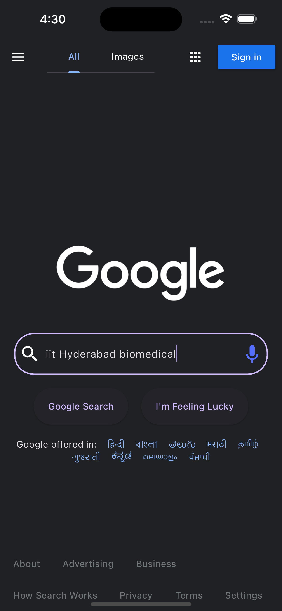

# Google Search Clone

This project is a clone of the Google Search interface, implemented using the Flutter framework. It aims to replicate the basic functionality and user experience of the Google Search web application, allowing users to perform searches, view search results, and navigate through them.

## Features

- **Search Interface**: Provides a search bar where users can input their search queries.
- **Search Results**: Displays search results fetched from the Google Custom Search JSON API.
- **Responsive Design**: Adapts its layout and UI components based on the screen size, ensuring a consistent experience across different devices.
- **Pagination**: Supports pagination for navigating through multiple pages of search results.
- **Language Translation**: Includes translation buttons for offering the Google Search interface in multiple languages.

## Screenshots

<div style="display: flex; justify-content: space-between;">
  
  
  
</div>

## Getting Started

To run this project locally, follow these steps:

1. **Clone the repository**:

   ```bash
   git clone https://github.com/aryanbhardwaj24/google_search_clone.git
   ```

2. **Navigate to Directory**: Change into the project directory:

   ```bash
   cd google_search_clone
   ```

3. **API Keys Setup**: You need to obtain API keys from the Google Custom Search JSON API. Create a new file named `api_keys.dart` inside the `lib/config/` directory. Add your API key and context key to this file as follows:

   ```dart
   // lib/config/api_keys.dart

    const String apiKey = 'YOUR_API_KEY_HERE';
    const String contextKey = 'YOUR_CONTEXT_KEY_HERE';
   ```

4. **Install Dependencies**: Install required dependencies using the Flutter package manager:

   ```dart
   flutter pub get
   ```

5. **Run the App**: Launch the app on your local device or simulator:

   ```dart
   flutter run
   ```

## Usage

1. Upon launching the app, you'll see the Google Search interface with a search bar.
2. Enter your search query in the search bar and press Enter or tap the search icon.
3. View the search results displayed below the search bar.
4. Navigate through the search results using the pagination buttons.
5. Use the translation buttons to switch between different language versions of the Google Search interface.

## Technologies Used

- **Flutter**: A UI toolkit for building natively compiled applications for mobile, web, and desktop from a single codebase.
- **Dart**: A programming language used for building Flutter apps.
- **Google Custom Search JSON API**: Used for fetching search results data.
- **Git**: Version control system for tracking changes in the project codebase.

## License

This project is licensed under the MIT License - see the [LICENSE](LICENSE) file for details.

## Author

[Aryan Bhardwaj](https://github.com/aryanbhardwaj24)
